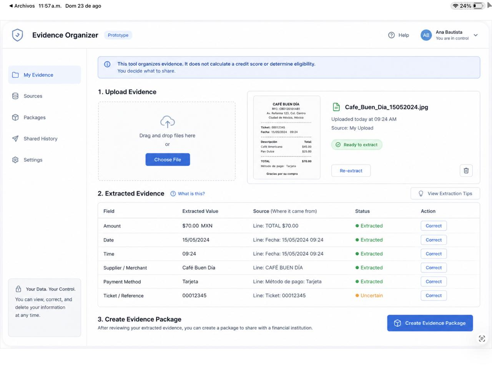

# WEEK 3 — MINIMUM VIABLE WORKFLOW PACKET

## 1. Problem in My Words

Small Mexican businesses often make payments to people they know only through WhatsApp. Before paying, they may have screenshots, names, account details, or messages, but they do not always know if the available information matches.

My product will help them compare this information before making a payment, without claiming that a person is safe, trustworthy, or fraudulent.
## 2. Exact User

María is a 54-year-old informal food seller in Mexico. She mainly uses WhatsApp, reads slowly, is not comfortable with complex apps, and distrusts automated financial decisions.

## 3. Success Definition

Before the module closes, María can upload one screenshot related to a proposed payment, enter the name of the person she expects to pay, and receive a simple result showing whether the available information is consistent, inconsistent, or insufficient.
## 4. Scope Cut

This week I am NOT building:

•⁠  ⁠A generic deepfake detector.
•⁠  ⁠A fraud score.
•⁠  ⁠A trust score.
•⁠  ⁠A system that declares a person safe or fraudulent.
•⁠  ⁠Bank or government identity verification.
•⁠  ⁠Automatic payment blocking.
•⁠  ⁠A full business platform.

I am only testing the minimum workflow needed to compare counterparty information before payment.
## 5. Long-View Paragraph

If this slice works, in three years the product could become a simple pre-payment verification assistant for small businesses in Mexico.

It could compare information from WhatsApp conversations, payment instructions, invoices, and previous transactions before the user sends money.

The product would always show what the evidence supports and what remains uncertain, instead of deciding whether a person is trustworthy.
## 6. Benchmark

Best existing solution on Earth:
Modern bank and payment-platform verification systems that compare structured identity and payment information before a transaction.

Mine differs or localizes by:
My product is designed specifically for small Mexican businesses that transact through WhatsApp. It works with limited and informal evidence and shows uncertainty instead of giving the user a generic trust or fraud score.
## 7. Image-Generated Mockup

The following image-generated mockup shows the proposed minimum workflow for checking counterparty information before payment.

## 8. Feature Flow — Mermaid Diagram

⁠ mermaid
flowchart TD
    A[Maria opens the app] --> B[Uploads payment screenshot]
    B --> C[Enters expected counterparty name]
    C --> D[AI extracts visible information]
    D --> E[System compares the information]
    E --> F{Result}
    F -->|Consistent| G[Show what matches]
    F -->|Inconsistent| H[Show the specific difference]
    F -->|Insufficient| I[Explain what information is missing]
    G --> J[Maria decides what to do next]
    H --> J
    I --> J
 ⁠## 8. Feature Flow — Mermaid Diagram
## 9. Actor Flow — Swimlane

⁠ mermaid
flowchart LR
    subgraph USER[Maria]
        U1[Upload screenshot]
        U2[Enter expected name]
        U3[Read result]
        U4[Choose next action]
    end

    subgraph SYSTEM[App]
        S1[Validate input]
        S2[Send evidence for analysis]
        S3[Display bounded result]
    end

    subgraph AI[AI]
        A1[Extract visible information]
        A2[Compare information]
        A3[Return consistent, inconsistent, or insufficient]
    end

    U1 --> S1
    U2 --> S1
    S1 --> S2
    S2 --> A1
    A1 --> A2
    A2 --> A3
    A3 --> S3
    S3 --> U3
    U3 --> U4
 ⁠## 10. Architecture + Stack

| Layer | Tool | Purpose |
|---|---|---|
| Frontend | Next.js | Simple user interface |
| Hosting | Vercel | Public live URL |
| Repository | GitHub | Version control and commits |
| Development | VS Code | Build and edit the project |
| AI | Vision + LLM | Read the screenshot and compare information |
| Storage | None for MVP | Avoid storing personal data |

## 11. Security Floor

•⁠  ⁠No API keys or secrets in the code or GitHub.
•⁠  ⁠API keys will use Vercel environment variables.
•⁠  ⁠No real personal data will be used in the demo.
•⁠  ⁠Inputs will be validated.
•⁠  ⁠Uploaded images will not be permanently stored.
•⁠  ⁠Any simulated AI output will be clearly labeled.
